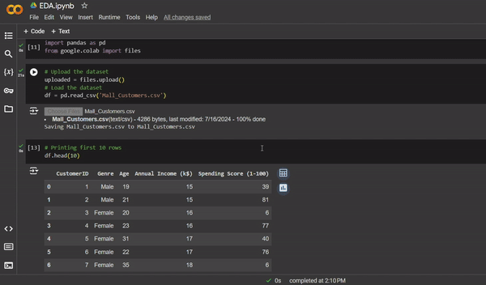

# Mall Customer Segmentation – Clustering Analysis  

This project performs **customer segmentation** using clustering techniques to group customers based on their purchasing behavior. The insights help businesses understand customer patterns and enhance targeted marketing strategies.  
## Preview

## 📌 Features  
- 🏬 **Data analysis & preprocessing** on customer dataset  
- 📊 **Exploratory Data Analysis (EDA)** for pattern recognition  
- 🎯 **Clustering using K-Means** to segment customers  
- 🔍 **Visual insights** through graphs and charts  
- 📈 **Recommendations for business strategies**  

## 💻 Tech Stack  
- **Python, Pandas, Matplotlib, Seaborn, Scikit-learn**   
